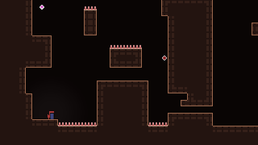

# celeste-lite

`celeste-lite` is an unofficial TypeScript/Phaser browser prototype focused on studying Celeste-like player movement, input timing, room flow, assists, and small player-facing visual systems.

It is a small programming study, not a full game, engine, or content recreation. It exists with respect for Celeste's design craft and for the technical material its creators have shared with the community.

This project is not affiliated with, endorsed by, or associated with Maddy Makes Games, Inc. or Extremely OK Games, Ltd. It does not include Celeste art, audio, maps, screenshots, commercial game files, or other official game assets.

[](https://coolspring8.github.io/celeste-lite/)

**Play the demo:** <https://coolspring8.github.io/celeste-lite/>

## What This Is

- A Phaser 3 prototype with fixed-step platformer movement at a 320x180 pixel-art viewport.
- A TypeScript implementation of Celeste-inspired player movement, including jump timing, dash states, climbing, stamina, refills, spikes, jump-throughs, room transitions, death/respawn flow, and pause/unpause timing.
- A test-backed mechanics sandbox. The deeper technique coverage lives in [docs/tech-checklist.md](docs/tech-checklist.md).
- A code-generated visual prototype. Player glyphs, particles, lighting, tiles, and transition effects are created locally rather than copied from Celeste assets.

## Scope

The goal is to study and implement a narrow slice of Celeste-inspired movement and presentation in a browser-friendly TypeScript codebase. The project leans on reference-backed behavior when the released source material supports it, and keeps local approximations explicit when systems are missing or speculative.

Non-goals:

- No official Celeste assets, maps, story content, screenshots, audio, or commercial game files.
- No claim of complete Celeste engine parity or full entity coverage.
- No controller or mobile-ready runtime yet. The current playable path is keyboard-first.
- No claim of exact parity where the local reference surface does not support it.

## Technical Notes

The prototype runs at a 320x180 pixel-art viewport with 8px tiles, which mirrors Celeste's camera resolution and scale. This resolution integer-scales cleanly to common 16:9 display heights.

The code is split around a few main responsibilities:

- `src/player/Player.ts`: movement state machine, timers, collision-facing player behavior, assists, and emitted gameplay effects.
- `src/entities/`: Monocle-inspired entities, colliders, grids, tracker, hazards, refills, jump-throughs, and camera-related runtime objects.
- `src/input/`: action-oriented virtual input model, keyboard binding normalization, button buffers, and newer-input resolution.
- `src/GameScene.ts`: Phaser scene orchestration, fixed-step updates, room flow, pause menus, death/respawn sequences, camera behavior, lighting, and debug overlays.
- `src/view/`: generated player glyph rendering, hair, particles, pause UI, intro/wipe effects, and death/respawn presentation.
- `tests/`: focused coverage for mechanics, parity constants, room behavior, input lifecycle, options, lighting, and visual models.

## Controls

Default keyboard controls:

- Arrow keys: move and aim
- `C`: jump / confirm / start
- `X`: dash / cancel
- `Z`: grab
- `Esc`: pause / cancel
- Backtick: debug overlay

Keyboard bindings and assist options can be changed from the pause menu.

## Development

This project uses Bun, TypeScript, Vite, and Phaser.

```sh
bun install
bun run dev
```

Useful checks:

```sh
bun test
bun run build
```

The build script runs `tsc --noEmit` before `vite build`, so TypeScript checking and the production bundle stay separate.

## Credits and References

Celeste is owned by its respective rights holders. This repository is unofficial and is not affiliated with or endorsed by the Celeste team, Maddy Makes Games, or Extremely OK Games.

Reference and inspiration sources include:

- [Celeste](https://www.celestegame.com/) by its original creators and team. Related official sites include [Maddy Makes Games](https://www.mattmakesgames.com/) and [Extremely OK Games](https://exok.com/).
- The publicly released [`Player.cs`](https://github.com/NoelFB/Celeste/blob/master/Source/Player/Player.cs) from [NoelFB/Celeste](https://github.com/NoelFB/Celeste), used as the main technical reference for player movement, states, physics constants, and some visual behavior. That repository presents the released class files as a learning resource and notes that its MIT license applies to the released code, not to the commercial Celeste game or assets.
- Maddy Thorson's [Monocle Engine](https://github.com/JamesMcMahon/monocle-engine), consulted through a public mirror, which informed parts of the local entity, collider, state machine, actor movement, and virtual input architecture.
- Noel Berry's public explanation of Madeline's hair implementation on [Reddit](https://www.reddit.com/r/gamedev/comments/9a0cfr/comment/e4rvrg2/) and the [smalleste](https://github.com/CelesteClassic/smalleste/blob/main/smalleste.p8) source, which inspired the optional dynamic hair implementation.
- The tiny player glyph is original and generated in code. It is inspired by the community sqrt(11) shorthand for Madeline, especially Blank_Fei / 空白飞呜's sqrt(11) mod pages on [GameBanana](https://gamebanana.com/mods/607960) and [Bilibili](https://www.bilibili.com/video/BV1TDGuzWEHn/). It carries over the idea, not the mod sprite or Celeste assets.
- Noel Berry's post [Remaking Celeste's Lighting](https://noelberry.ca/posts/celeste_lighting/), which inspired the lighting experiment. This prototype uses a local mesh/visibility-polygon approach rather than reproducing the optimized cutout pipeline described there.
- Solid tile presentation is loosely inspired by gym rooms in the [Strawberry Jam Collab](https://gamebanana.com/mods/424541). No Strawberry Jam assets are included.

Third-party reference files under [reference/](reference/) retain their own notices.

## License

Unless otherwise noted, this repository's original source code and documentation are licensed under the MIT License. See [LICENSE](LICENSE).

Some documentation or reference materials may carry separate notices at the file level. In particular, files marked `SPDX-License-Identifier: GPL-3.0-only` are licensed under GPLv3 only.

Third-party reference files under [reference/](reference/) retain their own notices and are not authored by this project.

Celeste IP, names, characters, art, audio, maps, screenshots, and commercial game assets are not included in this repository and are not licensed by this repository. Celeste-related names are used only for attribution and descriptive reference.
